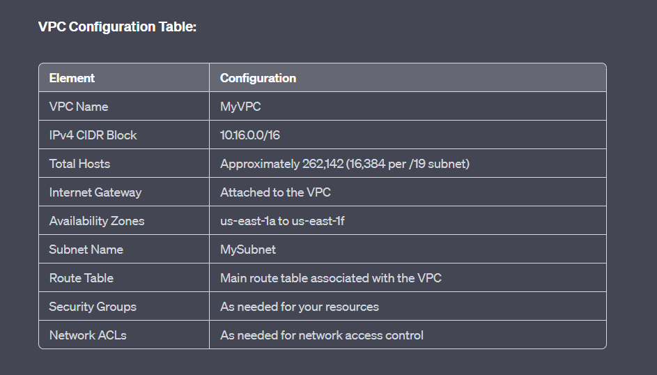
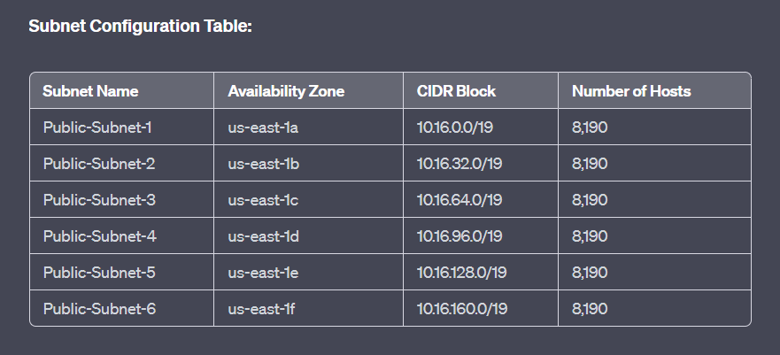

# Terraform-Aws-Infrastructure


Terraform-modules to create VPC,ASG that mounts to an EFS automatically

## Notes
Every user input variable has it's default value that you can override it but as a start.You just need to hash # the input variable in the main tf file in Every module to run without problems.


## Applying the infrastructure 


 

```bash
  terraform init
  terraform apply 
```
    
## VPC Architecture 




## subnets


